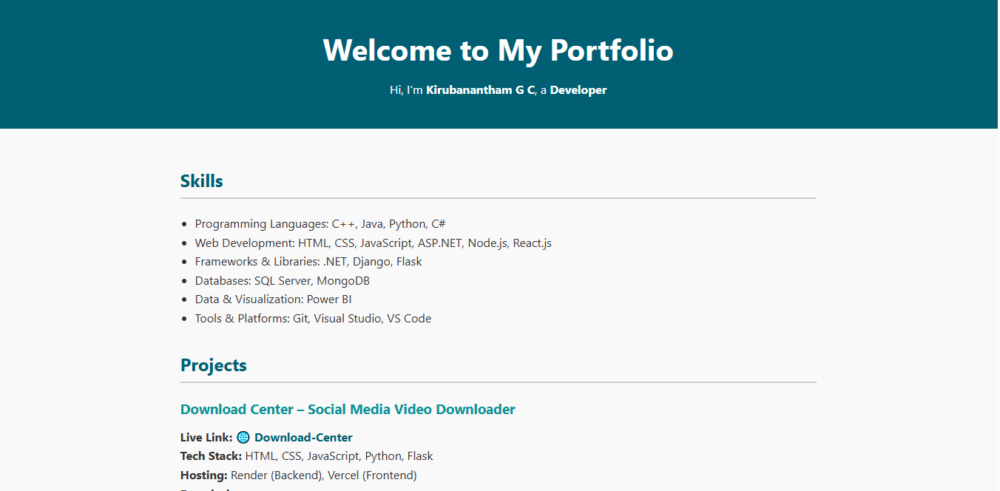
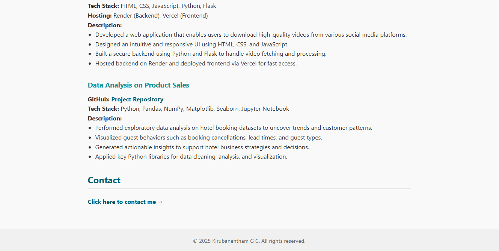
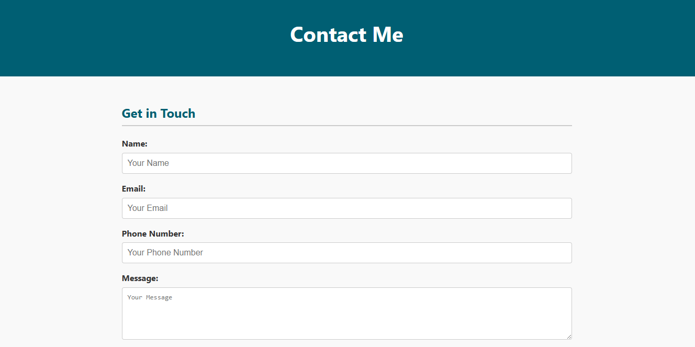
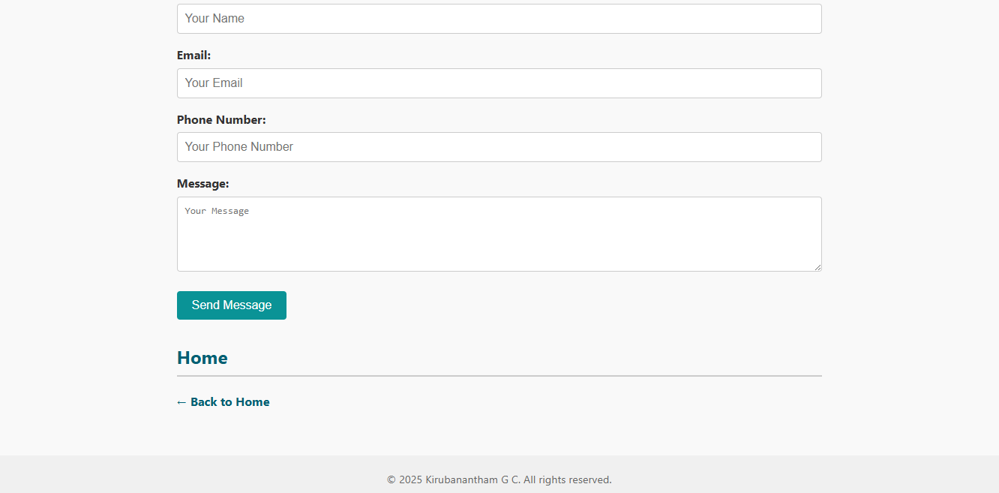

Task6-portfolio-website
--------------------------

🧑‍💻 Kirubanantham G C – Personal Portfolio Website

This is a simple and professional **personal portfolio website** built using Python, Flask, HTML, CSS, and Bootstrap concepts. It includes a home page to showcase skills and projects, and a contact form that saves messages to a `.csv` file.

---

🚀 Features
------------
- ✅ Flask-based backend
- ✅ Stylish, responsive home page
- ✅ Contact form with POST handling
- ✅ Message logging into a `.csv` file
- ✅ Easy navigation between pages

---

📷 Screenshots
-----------------
🏠 Home Page
----------------





📬 Contact Page
-----------------





---


---

⚙️ Setup Instructions
----------------------
1. **Clone the repository** (or copy the files):
    ```bash
    git clone https://github.com/yourusername/portfolio-flask.git
    cd portfolio-flask
    ```

2. **Install Flask** (if not already):
    ```bash
    pip install Flask
    ```

3. **Run the app**:
    ```bash
    python app.py
    ```

4. **Visit the site**:
    Open `http://127.0.0.1:5000/` in your browser

---

✉️ Contact Form Output
-------------------------
Submissions from the contact form are saved in `messages.csv` with the following columns:

- Name
- Email
- Phone Number
- Message

You can open it in Excel or any spreadsheet tool to review.

---

🔐 Optional Enhancements
---------------------------
- Add form validation or CAPTCHA
- Send contact form data to your email using SMTP
- Add a backend dashboard to review messages
- Deploy to **Render**, **Railway**, or **PythonAnywhere**

---
 📄 License
-------------
This project is open-source and free to use.

---

🙋‍♂️ Author
-----------
**Kirubanantham G C**  


---
